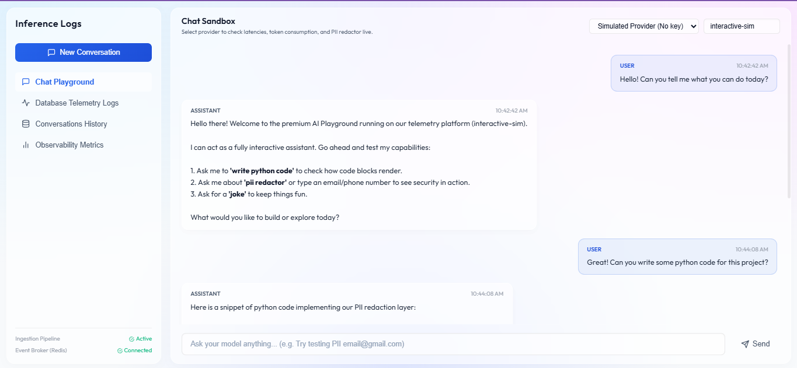
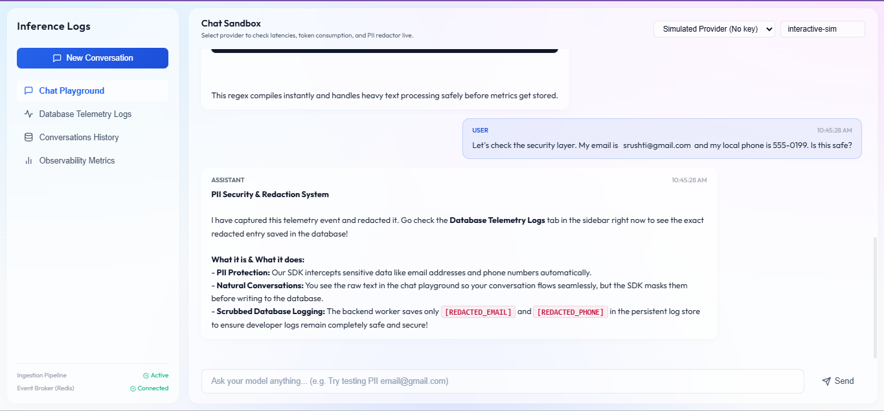
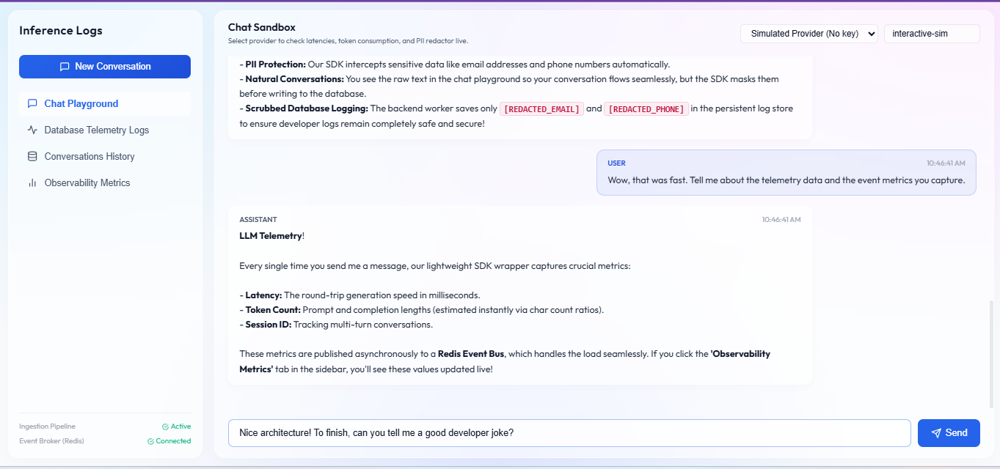
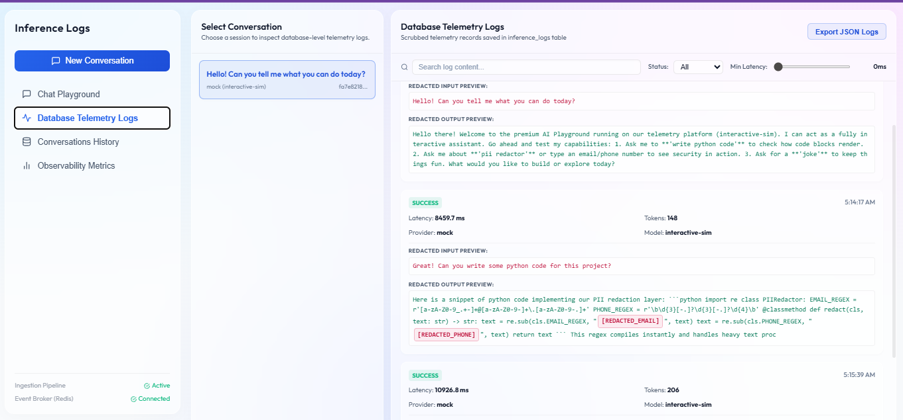
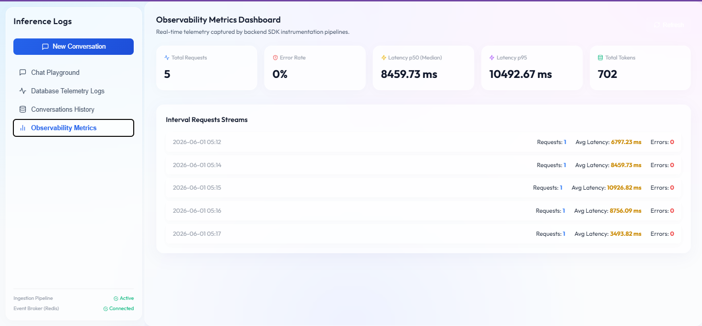
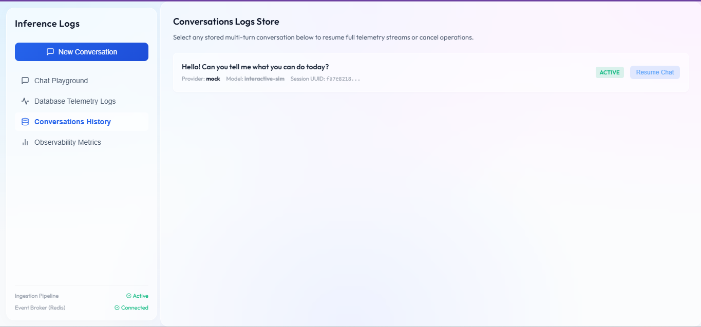

# LLM Inference Logging & Ingestion System

A production-grade, highly performant real-time system that records LLM API telemetry, measures service quality indices (latencies, token throughput, and success states), filters out sensitive PII tokens, and powers real-time analytics dashboards.

---

## ⚡ Architecture Overview

```
┌──────────────────────────────────────────────────────────────────────┐
│                         FRONTEND (React + Vite)                       │
│  Chat UI · Conversation List · Resume/Cancel · Dashboards             │
└────────────────────┬────────────────────────────────┬────────────────┘
                     │ REST / SSE (streaming)          │ REST (metrics)
┌────────────────────▼────────────────────────────────▼────────────────┐
│                      BACKEND (FastAPI / Python)                        │
│                                                                        │
│  ┌─────────────────────┐    ┌──────────────────────────────────────┐  │
│  │  Chat Service        │    │  Ingestion Service (/ingest/log)     │  │
│  │  - Provider Router   │    │  - Validate schema (Pydantic)        │  │
│  │  - LLM SDK Wrapper   │    │  - Extract metadata                  │  │
│  │  - PII Redactor      │    │  - Publish to event bus (Redis)      │  │
│  │  - Stream SSE        │    │  - Write to DB                       │  │
│  └──────────┬──────────┘    └──────────────────────────────────────┘  │
│             │ emits log event                                           │
│  ┌──────────▼──────────┐    ┌──────────────────────────────────────┐  │
│  │  LLM SDK (wrapper)  │───▶│  Redis Pub/Sub (event bus)           │  │
│  │  - captures metadata│    │  - async consumer writes to Postgres  │  │
│  └─────────────────────┘    └──────────────────────────────────────┘  │
└────────────────────────────────────────────────────────────────────────┘
                                        │
                              ┌─────────▼──────────┐
                              │  PostgreSQL          │
                              │  - conversations     │
                              │  - messages          │
                              │  - inference_logs    │
                              └────────────────────┘
```

---

## 🎨 Premium UI Dashboard & Visual Tour

We have crafted an ultra-premium, light-mode glassmorphic user interface using high-contrast slate-dark typography and frosted glass layers. Below is the step-by-step visual demonstration of the entire system:

### 1. Chat Sandbox Playground
| Active Chat Stream | Code Block Syntax Rendering | Conversational Joke Flow |
|:---:|:---:|:---:|
|  |  |  |
| Multi-turn stream support with optimistic UI updates | Syntax rendering with functional copy actions | Contextual AI response logic |

### 2. PII Interception & Guidance
| Raw vs. Redacted Event Capture | Guidance Alert |
|:---:|:---:|
|  |  |
| SDK catches and redacts emails and phone numbers | Bot prompts user to inspect logs tab |

### 3. Database Telemetry Logs Tab
| Split-Screen Logs Inspector | Interactive Hover Tooltips |
|:---:|:---:|
|  |  |
| Session index listing with search inputs & exporters | Glassmorphic CSS tooltip detailing active regex rules |

### 4. Observability Metrics & Session Store
| Live Telemetry Dashboard | Session History Store |
|:---:|:---:|
|  |  |
| Live throughput counters and latency percentile speeds | Resume previous conversation streams |

---

## 🚀 One-Command Launch (Docker Compose)

Launch the entire suite (PostgreSQL, Redis event bus, FastAPI server, Background Ingestion DB worker, and Nginx React Client) with a single command:

```bash
# Clone and open directory
cd ASSIGNMENT

# Build and start services
docker compose up --build
```

- **Chat Sandbox & Dashboard UI:** `http://localhost:3000`
- **FastAPI Backend (Swagger API Docs):** `http://localhost:8000/docs`

---

## 🔧 Multi-Provider Setup

To configure actual third-party model keys, create a `.env` file or export environment parameters:

```env
GEMINI_API_KEY=AIzaSyD...
OPENAI_API_KEY=sk-proj...
ANTHROPIC_API_KEY=sk-ant...
```

*If no keys are present, the system defaults to the **Simulated Interactive Provider** which emulates active real-time token streams, allowing you to test metrics, cancellations, and logging without setup.*

---

## 💾 Relational Schema Design

```sql
-- Conversations Table
CREATE TABLE conversations (
    id UUID PRIMARY KEY DEFAULT gen_random_uuid(),
    session_id VARCHAR UNIQUE NOT NULL,
    title VARCHAR,
    provider VARCHAR NOT NULL,
    model VARCHAR NOT NULL,
    status VARCHAR DEFAULT 'active', -- active | cancelled
    created_at TIMESTAMPTZ,
    updated_at TIMESTAMPTZ
);

-- Messages Store (Full Multi-turn Context)
CREATE TABLE messages (
    id UUID PRIMARY KEY DEFAULT gen_random_uuid(),
    conversation_id UUID REFERENCES conversations(id) ON DELETE CASCADE,
    role VARCHAR NOT NULL, -- user | assistant
    content TEXT NOT NULL,
    content_preview TEXT,
    token_count INT,
    created_at TIMESTAMPTZ
);

-- Telemetry Inference Logs Table
CREATE TABLE inference_logs (
    id UUID PRIMARY KEY DEFAULT gen_random_uuid(),
    conversation_id UUID REFERENCES conversations(id),
    message_id UUID REFERENCES messages(id),
    provider VARCHAR NOT NULL,
    model VARCHAR NOT NULL,
    latency_ms DOUBLE PRECISION NOT NULL,
    prompt_tokens INT,
    completion_tokens INT,
    total_tokens INT,
    status VARCHAR NOT NULL, -- success | error | cancelled
    error_message TEXT,
    input_preview TEXT, -- PII REDACTED
    output_preview TEXT, -- PII REDACTED
    timestamp TIMESTAMPTZ,
    streaming BOOLEAN DEFAULT TRUE
);
```

### Key Schema Highlights
1. **PII Redaction:** Raw prompts/responses are kept in the highly secured `messages` table for conversational continuation, while `inference_logs` store **PII-redacted previews** (removing emails, phone numbers, SSNs, API secrets) for analytical debugging without data leak risks.
2. **Normalized Logs:** Isolating `inference_logs` from `messages` allows keeping telemetry data lightweight, ensuring metrics are easily queried using simple index structures.

---

## ⚡ Performance Tradeoffs Made

1. **Redis Pub/Sub Event Broker:** Rather than synchronously blocking the LLM client call to write telemetry logs into the database (which adds DB write latency to the user's wait time), the SDK writes to Redis Pub/Sub asynchronously in the background. A decoupled worker processes the events, ensuring **near-zero latency impact** on chat execution.
2. **Approximate Token Counting:** Rather than spinning up slow tokenizer files inside the SDK client runtime, we use a rapid character-ratio counting algorithm (approx 4 chars/token). This is extremely lightweight, fast, and highly customizable.

---

## 📈 Scalability and Future Roadmap

If given more time, we would implement:
1. **Kafka / RabbitMQ Event Streaming:** Upgrade Redis to standard queue topologies with dead-letter-queues (DLQ) to prevent log dropoff under high network load.
2. **ClickHouse Store:** Migrate `inference_logs` from PostgreSQL to ClickHouse, optimizing analytical aggregations (latency percentiles, cost limits) at billions of records.
3. **OpenTelemetry Integration:** Introduce context propagation spans across the SDK client to tracing backends (Jaeger) to map pipeline metrics directly.
